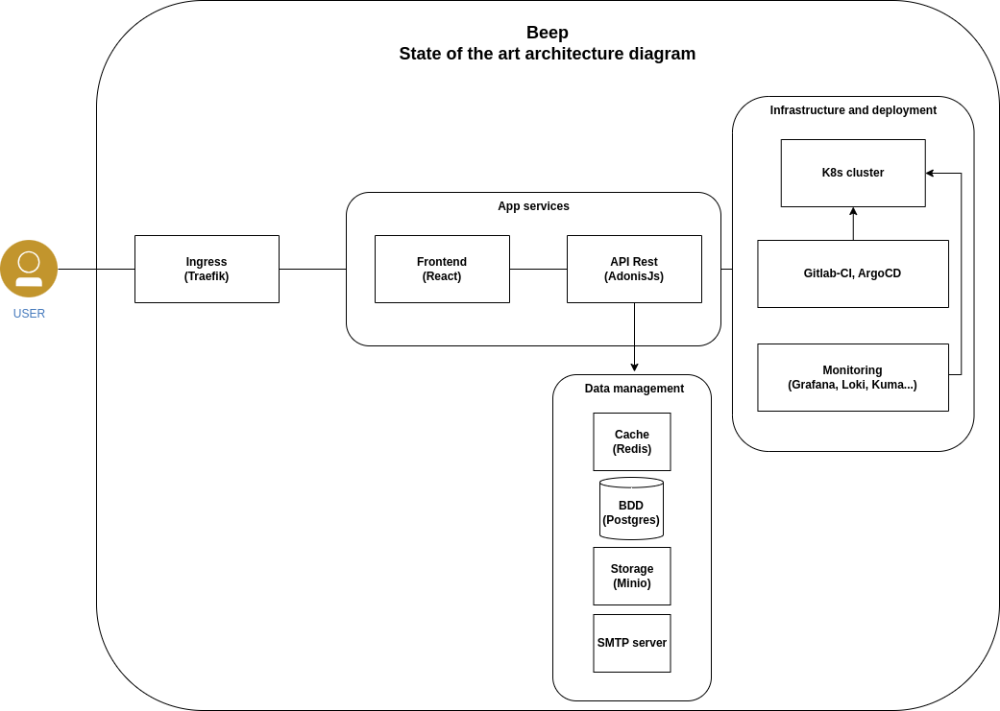
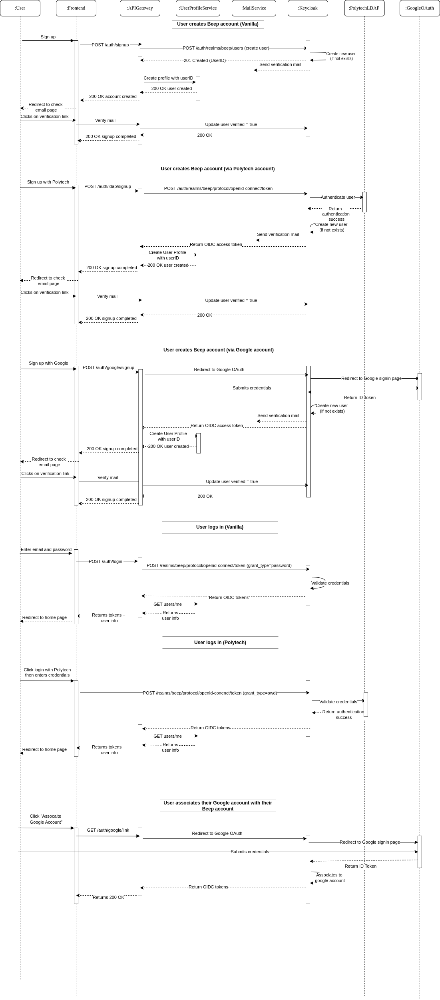

== 2. Authentication system with OIDC
=== 2.1 State of the Art of Beep Architecture

Here is an architecture diagram of the Beep application in the current state:

// TODO use the latest diagram

=== 2.2 Deployment Diagram for Beep Application and OIDC

Here is the deployment diagram of the Beep application with an OIDC authentication system added:
image::../diagrams/png/Déploiement_OIDC_Beep.drawio.png[width=1000,align=center]

=== 2.3 Sequence Diagrams

Here are the sequence diagrams for the signin and signup actions in the Beep application:
