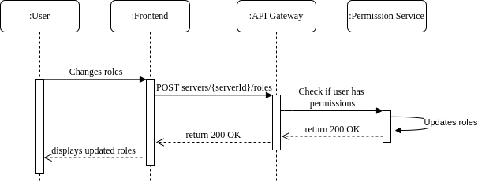
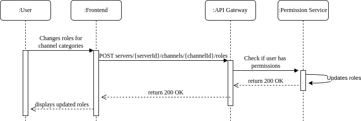
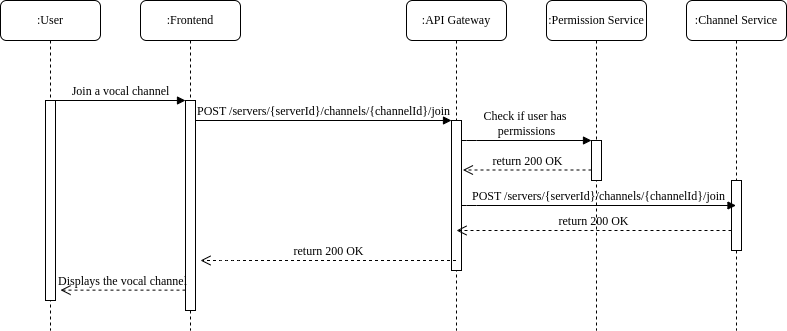
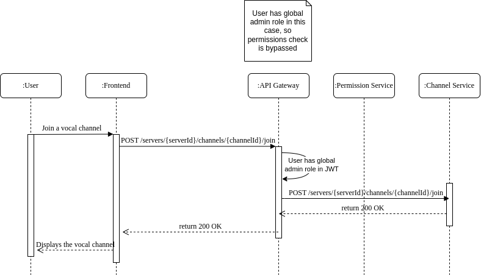

==== 4.1 Authorization service definition 

an authorization service is a system that determines whether a user or service has permission to perform a certain action or access a certain resource. it usually works alongside an authentication service (which verifies identity) but focuses on what a user can or cannot do once authenticated.

it can be based on role-based access control (RBAC), attribute-based access control (ABAC ), or policy-based access control (PBAC).

Articles to read:
https://medium.com/@kgignatyev/unification-of-authorization-for-ui-and-backend-with-casbin-1523758658f7
https://medium.com/@rohanraman6/integrating-keycloak-for-authentication-and-authorization-a-step-by-step-guide-72bd382a2bd1

==== 4.2 Technical and functional architecture and the technologies I recommend

I will use the permissions service to manage authorizations. This service is base on permissions and roles to manage the authorizations.
Every service when they need to know the permisions of a user will ask the permissions service. The permissions service will check the permissions of the user and will return 401 if the user doesn't have the permission to do the action or 200 if the user has the permission to do the action.

The permissions service will have a database with the permissions and the roles of the users. The permissions service will have an API to get the permissions of a user.

Example of request to the permissions service to create a channel :

```
POST /permissions HTTP/1.1
Host: permissions-service:8080
Content-Type: application/json
Authorization: Bearer token

Body : 
{
    "userId": "123",
    "resource": "channel",
    "action": "create",
    "serverId": "456"
}
```

==== Technologies:

For the permissions service, I will keep it simple and use a REST API with a database to store the permissions and the roles of the users. I will keep the technology already used in the project to keep the project simple and easy to maintain, which is AdonisJs for the API and PostgreSQL for the database.


==== 4.3 Sequence diagrams for the application's main actions

Here is the sequence diagrame for a user trying to change roles for a server : 



Here is the sequence diagrame for a user trying to change roles for channel categories :


Here is the sequence diagrame for a user trying to join a vocal channel :



Here is the sequence diagrame for a user who is a global administrator trying to join a vocal channel :
