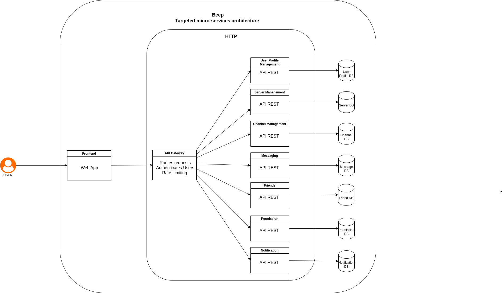

=== 1.3 Architecture diagram of the microservices  

// TODO use the latest diagram

I felt like the interactions between the different microservices were not clear enough if I added the main links between each microservice. 
So here they are:

.User Profile Management Service:
  - No main links with other services

.Server Management Service:
- Channel Management Service

.Channel Management Service:
- Server Management Service
- Messaging Service

.Messaging Service:
- Channel Management Service
- Notification Service

.Friends Service:
- Messaging Service
- Notification Service

.Notification Service:
- Messaging Service