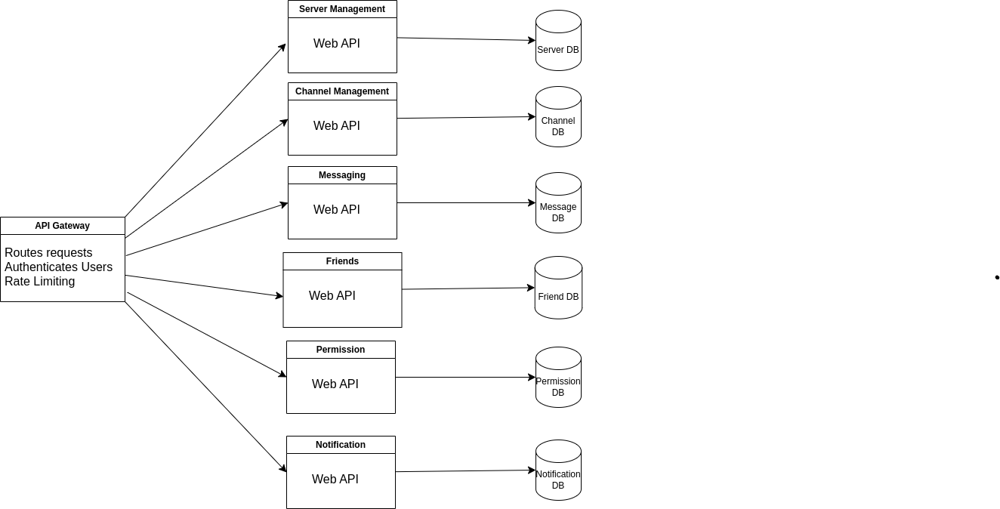
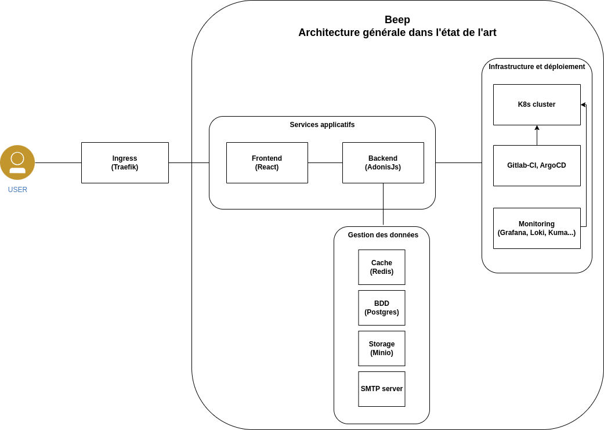
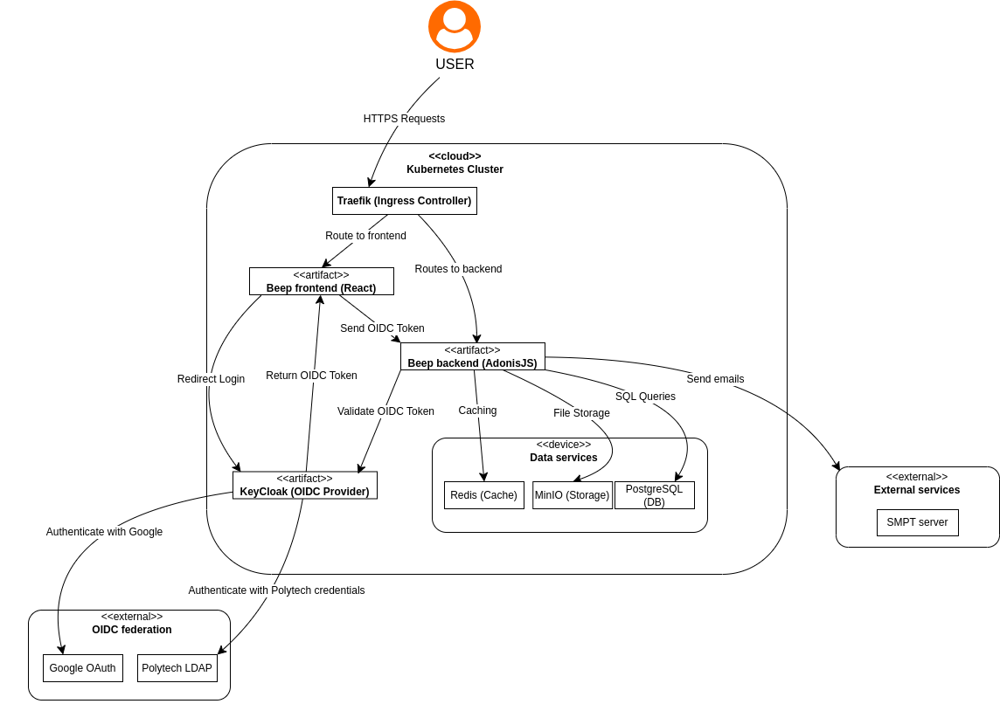
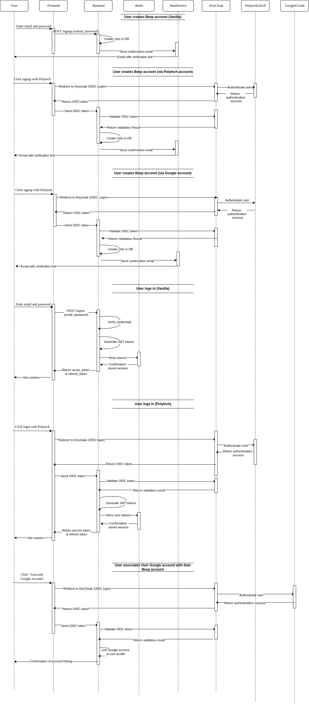

= Technical Architecture Document (TAD)
Author: Pauline Contat  
Date: 5 March  
:toc:  
:toclevels: 3  

== Introduction  
- Purpose of the document  
- References  

== 1. Prerequisites and Functional Breakdown  
=== 1.1 User Stories

==== Authentication and Authorization

As a guest user, I want to sign up so that I can create an account and access the platform.

As a guest user, I want to sign in so that I can access my account.

As a registered user, I want to update my profile so that I can keep my information up to date.

As a registered user, I want to reset my password so that I can recover my account.

As a registered user, I want to enable two-factor authentication so that I can add an extra layer of security to my account.

==== Server Management

As a server admin or with the right permissions, I want to create a server so that I can manage a community.

As a server admin or with the right permissions, I want to delete a server so that I can remove it permanently.

As a server admin or with the right permissions, I want to update server settings so that I can configure the server according to my needs.

As a server admin or with the right permissions, I want to manage roles and permissions so that I can control access to different features.

As a server admin or with the right permissions, I want to be able to invite users to my server so that I can grow my community.

As a server admin or with the right permissions, I want to create webhooks so that I can automate actions in my server.

==== Channel Management

As a server admin or with the right permissions, I want to create a channel so that I can organize discussions.

As a server admin or with the right permissions, I want to delete a channel so that I can remove unnecessary channels.

As a server admin or with the right permissions, I want to update channel settings so that I can configure the channel according to my needs.

As a server admin, I want to move channels so that I can reorder them.

As a registered user with the right permissions, I want to join a video or vocal call in a channel so that I can communicate in real-time with other users.

As a registered user, I want to share my screen during a call so that I can present content to others.

As a registered user, I want to mute/unmute myself during a call so that I can control my audio.

As a registered user, I want to select my audio and video devices so that I can choose the appropriate hardware for calls.

==== Messaging

As a registered user with the right permissions, I want to send messages in a channel so that I can communicate with other members.

As a registered user, I want to edit my messages so that I can correct mistakes.

As a registered user, I want to delete my messages so that I can remove them.

As a registered user, I want to pin messages so that important messages are highlighted.

As a server admin or with the right permissions, I want to delete inappropriate messages so that I can maintain a healthy community environment.

As a registered user, I want to mention other users in a message so that they are notified.

As a registered user, I want to be able to see a preview of links shared in messages so that I can decide if I want to open them.

As a registered user, I want to send private messages so that I can communicate directly with friends.

==== Frineds

As a registered user, I want to send friend requests so that I can connect with other users.

As a registered user, I want to accept friend requests so that I can add new friends.

As a registered user, I want to delete a friendship so that I can remove them from my friend list.

==== Notifications

As a registered user, I want to receive notifications for friend requests so that I am aware when someone wants to connect.

As a registered user, I want to receive notifications for private messages so that I know when someone contacts me.

As a registered user, I want to receive notifications when I am mentioned in a channel so that I can respond quickly.

=== 1.2 Functional Neighborhoods

==== Authentication and Authorization

Sign Up

Sign In

User Profile Management

==== Server Management

Create Server

Delete Server

Update Server Settings

Manage Roles and Permissions

==== Channel Management

Create Channel

Delete Channel

Update Channel Settings

Move Channels

Join Video/Vocal Calls

Share Screen

==== Messaging

Send Messages

Edit Messages

Delete Messages

Pin Messages

Send private messages

Mention Users

==== Friends

Send Friend Requests

Accept Friend Requests

Delete Friendship

==== Notifications

Receive Friend Request Notifications

Receive Private Message Notifications

Receive Mention Notifications

// TODO add user profile management in microservices

=== 1.3 Architecture diagram of the microservices  

[width=600,align=center]

== 2. Authentication system with OIDC
=== 2.1 State of the Art of Beep Architecture

[][width=600,align=center]

=== 2.2 Deployment Diagram for Beep Application and OIDC

.drawio.png[][width=600,align=center]

=== 2.3 Sequence Diagrams

.drawio.png[][width=600,align=center]

== 3. Inter microservices communication
=== 3.1 Inter-microservice communication orchestration, API systems, protocols used

==== 3.1.1 API Gateway
First of all, every request coming from the client, before reaching the different microservices, will go through an **API Gateway**. It allows the user to **authenticate** and **authorize** requests, ensuring only legitimate users can access the system. The gateway **routes** the different requests incoming from the client to the appropriate microservices, **enforces rate limiting** to prevent abuse, and can **cache** frequently requested data to improve performance. Additionally, it can **log** requests and responses, providing valuable insights for debugging and monitoring. The API Gateway also acts as a **security layer**, protecting microservices from direct exposure and potential attacks.

==== 3.1.2 Communication Protocols
The chosen approach for inter-microservice communication is to use **RESTful APIs** over **HTTP**. This approach is widely adopted, easy to implement, and allows seamless integration between services. Each microservice will expose its own API, which other services can call to exchange data. 

**Service discovery** will be handled using **Kubernetes DNS**, allowing microservices to dynamically locate and communicate with each other using service names such as `friends-service.beep.svc.cluster.local`. 

To ensure secure communication, inter-microservice requests will be managed by a **Service Mesh** (Istio for example). The Service Mesh will provide automatic **service-to-service authentication** using **mTLS** (Mutual TLS), ensuring that only authorized microservices can communicate with each other. It will also handle traffic management, load balancing, observability, and circuit breaking, ensuring a **resilient and secure** inter-microservice communication.

=== 3.2 Sequence diagram
Make a sequence diagram of the communication between some of your services to present your approach.

== 4. Authorization System  
=== 4.1 Authorization service definition 

=== 4.2 Technical and functional architecture and the technologies I recommend

=== 4.3 Sequence diagrams for the application's main actions

Note: Your solution should enable you to manage permissions by server, category and channel.
You'll also need to set global permissions for platform administrators.

== 5. Logging and Monitoring  

We want to be able to observe the system's behavior in response to a user request.

=== 5.1 system and the technical components to be implemented definition  

=== 5.2 Deployment diagram of the various elements

=== 5.3 Sequence diagram of a query to illustrate how the system works

=== 5.4 Needs of “security based logs”, to plug the system into a managed SOC

== 6. Production-Ready System  
=== 6.1 Management of Data Security, Backup, and Restore 
==== 6.1.1 Data Security
==== 6.1.2 Backup and Restore Strategies
==== 6.1.3 Diagrams

=== 6.2 Management of Observability and Services Supervision Integrated to an Existing Enterprise System
==== 6.2.1 Observability and Supervision in Enterprise Environments
==== 6.2.2 Diagrams

=== 6.Management of Infrastructure High Availability, Continuity Plans
==== 6.3.1 High Availability
==== 6.3.2 Continuity Plans
==== 6.3.3 Diagrams

=== 6.4 Target Diagram

== 8. Search Engine
=== 8.1 Functional and Technical Proposal for the Search Engine
We want the user to have a full-text indexing engine.
For example, a user typing the keyword “rabbit” (but this could be a string of words) should have all messages, etc. containing this keyword brought up in a user interface.
=== 8.2 UI Mockup of the Different Phases of the Use Case
=== 8.3 Technical Stack and the Indexing and Search Sequence Diagram

== Q9. Management of platform security issues
=== 9.1 Security Architecture
Analyze how you secure the various components of your architecture (network, microservices, etc.).
How do you secure communications between microservices?
Present your security proposal, using sequence diagrams to show how your system will work.

Make a Poc of securing helloworld microservices with each other and with the outside world.
